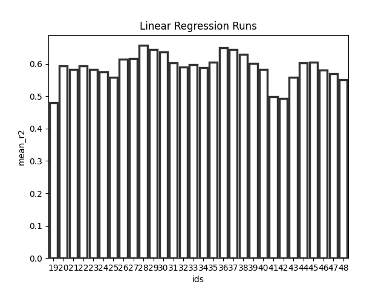
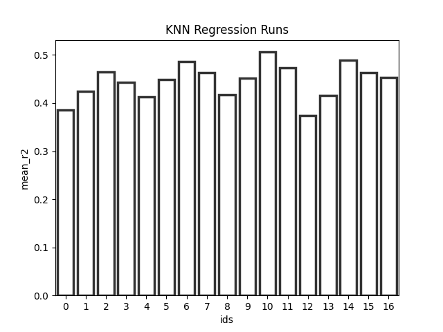
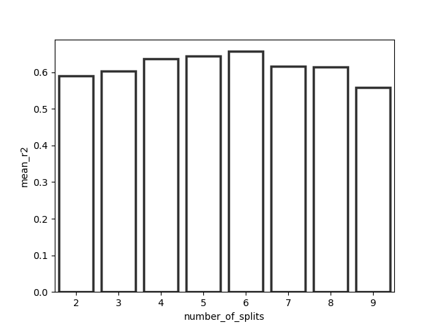
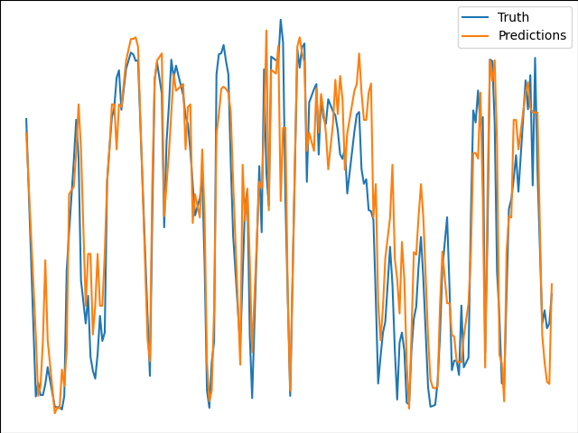
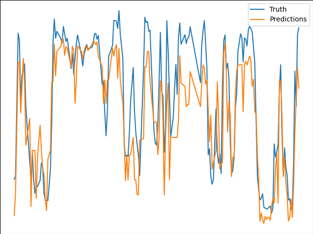
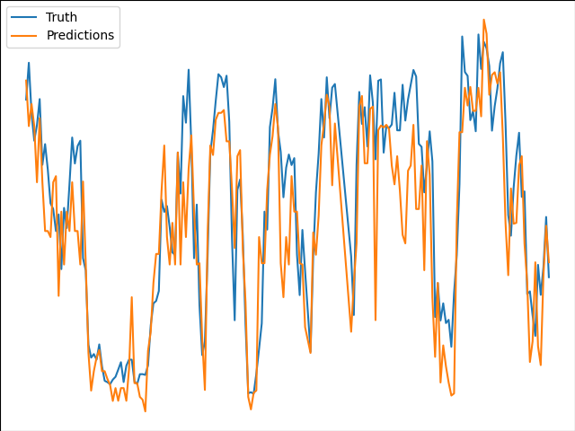
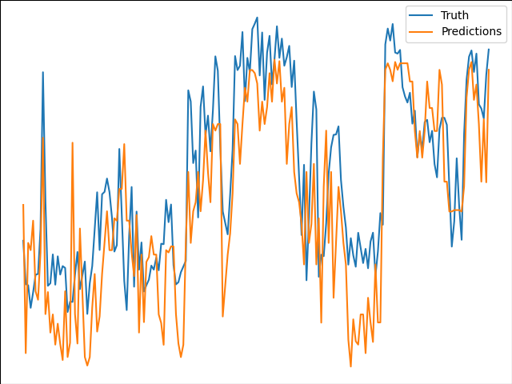
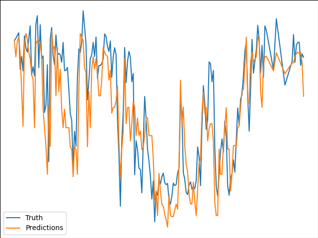
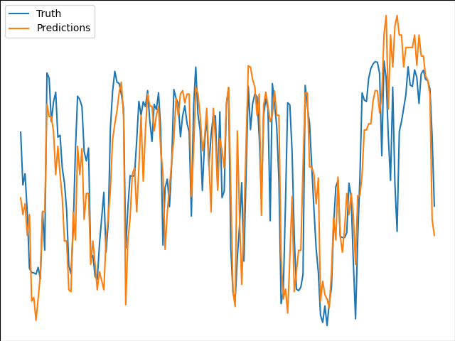

# Assignment 3
author: Lukas Rasocha (lukr@itu.dk)

## Intro and Structure

In this report I will discuss how I used `mlflow` (an open source tool for machine learning lifecycle) to pick the best performing model and set of its hyperparameters to predict a power production based on wind weather data (using `mlflow tracking`). Then I will explain how I used `mlflow projects` to package the code for reusability and reproducability and finally how I deployed the best performing model on a `Azure VM` using `mlflow model`. (you can find a thorough description on how to reproduce the entirity of this github repo in the README).


## Your choice of models and evaluation metrics

The task is to find the best performing regressor trained on historical data, that can predict power production from given weather forecast. The data comes from a static `json` file and contains many features. To train the model I however used only `Wind Speed` and `Wind Direction`. I experimented with two different regressors `Linear Regression` and `KNN regressor` (the exact pipeline can be seen in assignment 1).

To compare the different models and their variations I used the following metrics
- Mean Absolute Error
- Mean Squared Error
- R2 score
- Variance of MAE and MSE over the different splits

From the first assignment I know that the relationship between the dependent and independent variable is nonlinear, I therefore first started experimenting with `Linear Regression` and `Polynomial Features`. By running the following command

```
mlflow run . --experiment-name='lukr - Assignment3' -P model_name=lin_reg -P poly_degre=X -P number_of_splits=X
```

For KNN Regressor I ran similar experiments with different hyperparameters
```
mlflow run . --experiment-name='lukr - Assignment3' -P model_name=knn_reg -P number_of_splits=X -P n_neighbours=X -P weights=X
```

Then I put different values for `X` to experiment with different hyperparameters.

In the below figures I plotted all the runs and compared their `mean r^2 score` over the different splits

Linear Regression Runs           |  KNN Regression Runs
:-------------------------:|:-------------------------:
  |  

After this analysis I found the best performing model from the mean of `r2 scores` over the splits as this metric shows how well the model explains the variance of the data and is correlated with MAE and other regression metrics.

The best performing model had the following properties
- model: Linear Regression
- Degree of polynomial: 4
- Number of splits: 6

To further analyse the different number of folds for the cross validation we can look at the figure below

And scored:
- `r2: 0.657`
- `Mean MSE: 37.36`
- `Mean MAE: 4.77`
- `MSE Variance: 62.6`
- `MAE Variance: 0.392`
- `R2 Variance: 0.013`

To furher analyse how the number of folds for the cross validation affect the score of the best model we can look at the figure below.
<p align="center">
  
</p>


For each of the experiment runs I used `mlflow` to store artifacts such as the trained model and some relevant matplotlib plots. Below we can see how the model predicted the power production (tested on the 6 different `test` splits) and the actual power production that day. (x axis are the dates and y axis the power).

| | | |
|:-------------------------:|:-------------------------:|:-------------------------:|
| Split 1|   Split 2| Split 3|
| Split 4|   Split 5| Split 6|

From the above figures we can see that the model was able to learn and follows the trend of the real power data.

The model is currently hosted on `Azure VM` as a background process (using nohup command) and can be tested:
```
curl http://20.67.184.90:5000/invocations -H 'Content-Type: application/json' -d '{"columns": ["Speed", "Direction"], "data": [[10,"W"]]}'
```

## Final notes
I really advice to read through the thorough [README](https://github.com/lukyrasocha/mlflow-azure/blob/main/README.md) to get to know the exact implementation and steps for reproduction.
