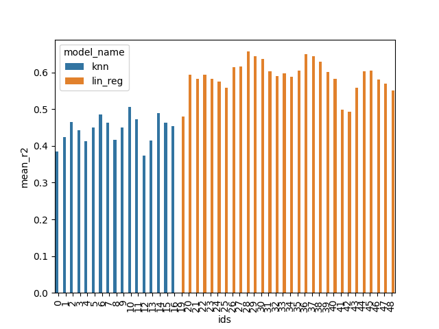

# Assignment 3
author: Lukas Rasocha (lukr@itu.dk)

## Intro and Structure

In this report I will discuss how I used `mlflow` (an open source tool for machine learning lifecycle) to pick the best performing model and set of its hyperparameters to predict a power production based on wind weather data (using `mlflow tracking`). Then I will explain how I used `mlflow projects` to package the code for reusability and reproducability and finally how I deployed the best performing model on a `Azure VM` using `mlflow model`. (you can find a thorough description on how to reproduce the entirity of this github repo in the [README](https://github.com/lukyrasocha/mlflow-azure/blob/main/README.md)).


## Choice of models and evaluation metrics

The task is to find the best performing regressor trained on historical data, that can predict power production from given weather forecast. The data comes from a static `json` file and contains many features. To train the model I however used only `Wind Speed` and `Wind Direction`. I experimented with two different regressors `Linear Regression` and `KNN regressor` (the exact pipeline can be seen in assignment 1).

To compare the different models and their variations I used the following metrics
- Mean Absolute Error
- Mean Squared Error
- R2 score
- Variance of MAE and MSE and R2 over the different splits

## Results

From the first assignment I know that the relationship between the dependent and independent variable is nonlinear, I therefore first started experimenting with `Linear Regression` and `Polynomial Features` by running the following command.

```
mlflow run . --experiment-name='lukr - Assignment3' -P model_name=lin_reg -P poly_degre=X -P number_of_splits=X
```

For KNN Regressor I ran similar experiments with different hyperparameters
```
mlflow run . --experiment-name='lukr - Assignment3' -P model_name=knn_reg -P number_of_splits=X -P n_neighbours=X -P weights=X
```

Then I put various values for `X` to experiment with different values. I used `mlflow` to log the parameters and metrics that I could then plot to compare the runs. 

<p align="center">
  
</p>

(Mean r2 is the average over all the r2 scores from the different k-folds in cross validation).

As any regression task, the goal is to find a model whose predictions are as close to the real values as possible, therefore metrics such as `MSE` or `MAE` nicely summarize how the model on average deviates from the desired values (for example `MSE = 0` would mean that the model predicted all the target values precisely). To choose the best model I however looked at `r2 score` since this metric shows how well the model explains the variance of the data which is correlated with the other metrics as well.
 
The best performing model had the following properties
- model: Linear Regression
- Degree of polynomial: 4
- Number of splits: 6

And scored:
- `r2: 0.657`
- `Mean MSE: 37.36`
- `Mean MAE: 4.77`
- `MSE Variance: 62.6`
- `MAE Variance: 0.392`
- `R2 Variance: 0.013`

To furher analyse how the number of folds for the cross validation affect the score of the best model we can look at the figure below. We can see that the score doesn't vary that much (`r2 variance: 0.013`).

<p align="center">
  
</p>


For each of the experiment runs I used `mlflow` to store artifacts such as the trained model and some relevant matplotlib plots. Below we can see how the model predicted the power production (tested on the 6 different `test` splits) and the actual power production that day. (x axis are the dates and y axis the power).

| | | |
|:-------------------------:|:-------------------------:|:-------------------------:|
| Split 1|   Split 2| Split 3|
| Split 4|   Split 5| Split 6|

From the above figures (unseen test data) we can see that the model was able to learn and follow the trend of the real power data, thus the generalization of the model is quite good.

The model is currently hosted on `Azure VM` as a background process (using nohup command) and can be tested:
```
curl http://20.67.184.90:5000/invocations -H 'Content-Type: application/json' -d '{"columns": ["Speed", "Direction"], "data": [[10,"W"]]}'
```
## Discussion of Mlflow and other alternatives
In this section I'd like to discuss the advantages of using `Mlflow` for your machine learning lifecycle and comparing the tool with other reproducability options.

An ML reproducable system is a system that can be repeatedly run on certain datasets and obtains the same (or similar) results. To achieve this can be crucial, since we wish to be able to run our system on all kinds of machines and obtain the same outcomes.

As stated in the lecture we should look at ML models as software derived from data and thus should follow the same rules especially when we want to achieve concepts such as continuous integration/continuous development pipelines (MLOps).

Core elements of a ML reproducable system:
- Code: To achieve reproducibility, you must track and record changes in code during experiments.
- Data: Adding new datasets, data distribution and sample changes will affect the outcome of a model. Dataset versioning and change tracking must be recorded to achieve reproducibility.
- Environment: For a project to be reproducible, the environment it was built in must be captured. Framework dependencies, versions, the hardware used, and all other parts of the environment must be logged and easy to reproduce.

These concepts is something that `mlflow` can help with. There are 3 main tools that `mlflow` offers which make the ML lifecycle much more convenient:
- MLflow Tracking: is used to record a clear overview of the performance of the experiment runs (together with parameters and artifacts)
- MLflow Projects: Enables a user to easily reproduce models with its corresponding code on any platform.
- MLflow Models: Packages models in a standard format so that they can be served as an endpoint through a REST API

Especially the function of `Mlflow projects` comes handy when working in a team or sharing code for others to reproduce results, since it lets you 
train, reuse, and deploy models with any library and package them into reproducible steps that other people/systems can use as a “black box,” without even having to know which library you are using.

That came handy, when deploying the model on `Azure VM`, since `mlflow` takes care of downloading all the necessary dependencies inside a new virtual environment so that running your project locally is exactly the same as running it on a remote VM.

To mention some alternative methods for reproducable systems, one could build a `docker image` and run the workflow inside a container which also enables reproducability across different machines and systems. Or using tools such as `Poetry` or `Pipenv` which are virtual environments and package management tools (they however don't incude features such as experiment logging, model deployment etc.). Conclusively there are a lot of tools that can work together to achieve same results as `mlflow`, but with comparison, `mlflow` is an easy and intuitive tool to use which contains a lot of useful functionalities for all kinds of ML related problems. 

## Final notes
I recommend to read through the thorough [README](https://github.com/lukyrasocha/mlflow-azure/blob/main/README.md) to get to know the exact implementation and steps for reproduction.

## References
https://www.mlflow.org/docs/latest/concepts.html
https://neptune.ai/blog/ways-ml-teams-use-ci-cd-in-production
https://neptune.ai/blog/how-to-solve-reproducibility-in-ml
https://learnit.itu.dk/pluginfile.php/295845/course/section/135117/Enterprise-grade%20ML.pdf
